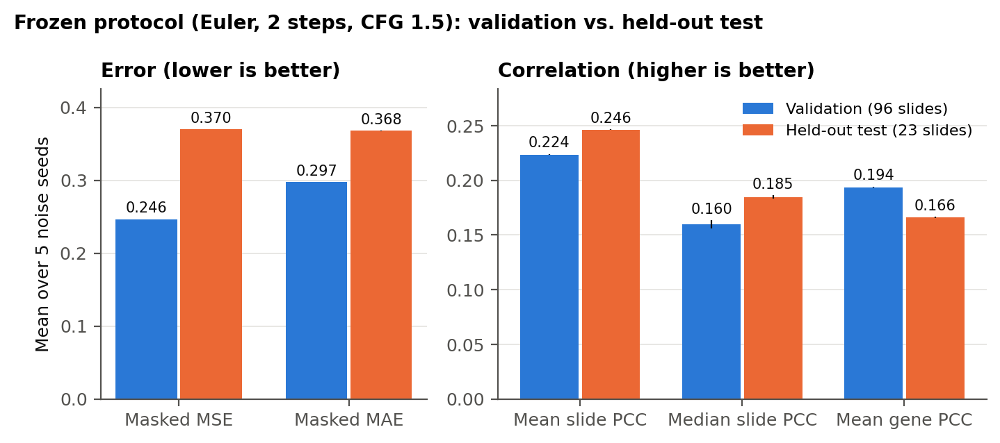
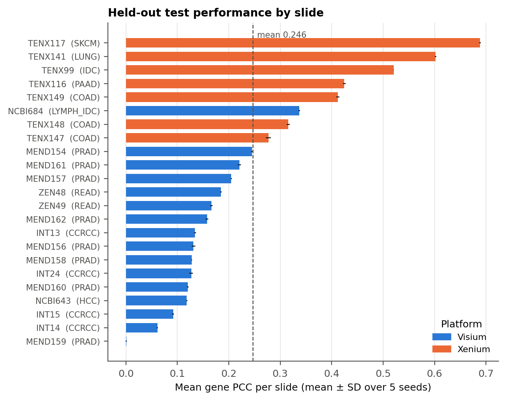
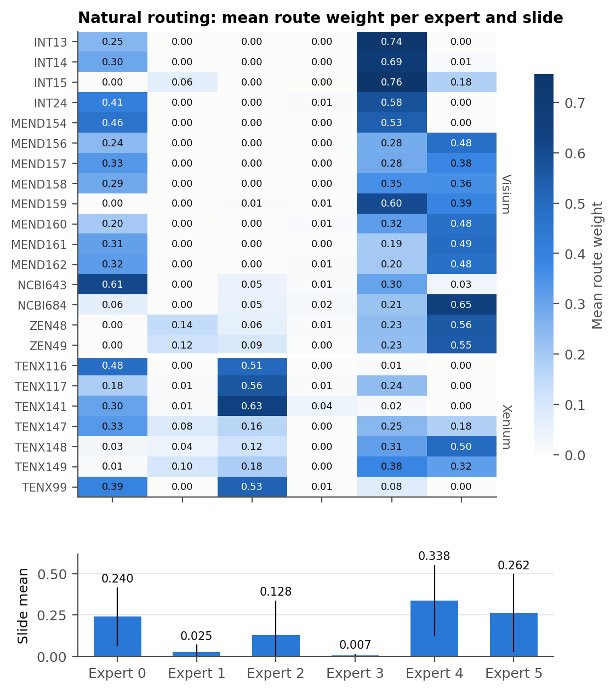
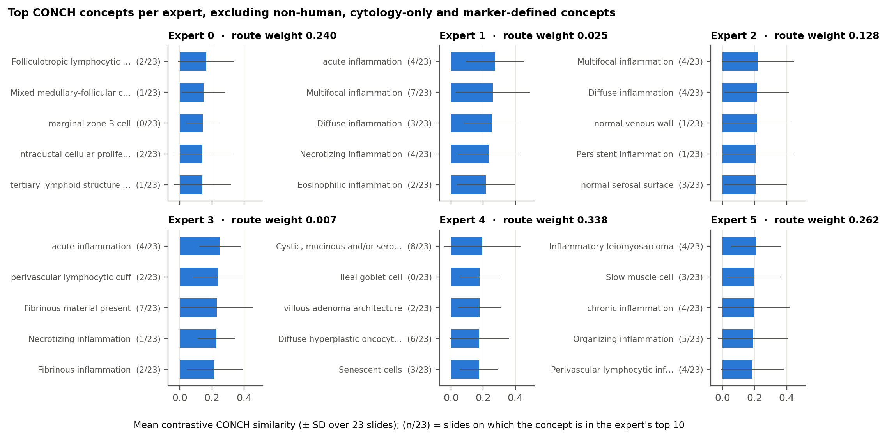
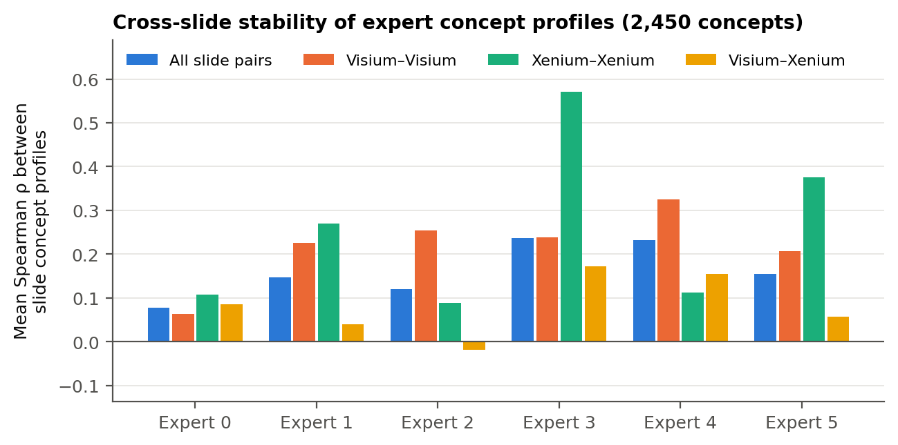

# Decoding the MoLF Experts

[MoLF](https://github.com/susuhu/MoLF) (Mixture of Latent Flows) predicts
spatially resolved gene expression from H&E histology with a Mixture-of-Experts
velocity field: a router sends each tissue patch to 2 of 6 experts. The experts
specialise, but what each one responds to is not visible from the model. This
project tries to describe the experts in pathology terms. It

1. retrains MoLF on image features from CONCH, a pathology vision-language
   model, so that the model's input lives in a joint image–text embedding space;
2. builds a vocabulary of pathology concepts from ontologies (NCIt, SNOMED CT,
   Cell Ontology, GO, UBERON, MSigDB) and PubMed, and embeds it with CONCH's
   text encoder;
3. scores each expert's highest-affinity patches against that vocabulary on 23
   held-out slides, and measures how stable the resulting "expert lexicon" is
   across slides and across spatial transcriptomics platforms (Visium, Xenium).

The retrained model, CONCH-MoLF, appears as *Run 2* in the run records and file
names; it is the only model reported here.

The full write-up is the project report,
[`paper/report.pdf`](paper/report.pdf); the project plan is in
[`docs/project_proposal.pdf`](docs/project_proposal.pdf).

## Main results

All numbers are from the final model (checkpoint epoch 239) with an
inference protocol selected on validation data only (Euler, 2 steps,
classifier-free guidance 1.5). Values are mean ± sample SD over 5 noise seeds.

### Gene-expression prediction

| Metric | Validation (96 slides) | Held-out test (23 slides) |
|---|---|---|
| Masked MSE | 0.2464 ± 0.0001 | 0.3699 ± 0.0002 |
| Masked MAE | 0.2974 ± 0.0000 | 0.3677 ± 0.0001 |
| Mean slide PCC | 0.2236 ± 0.0006 | 0.2464 ± 0.0004 |
| Median slide PCC | 0.1599 ± 0.0038 | 0.1846 ± 0.0016 |
| Mean gene PCC | 0.1937 ± 0.0005 | 0.1662 ± 0.0005 |



Performance is strongly platform-dependent (Fig. 4). The 7 Xenium test slides
reach a mean slide PCC of 0.46 against 0.15 for the 16 Visium slides, but
Xenium also carries 38% of the total squared error from 6% of the measured
entries, because its expression values are larger and denser. The frozen
GeneVAE-v2 reconstructs both platforms well on its own (mean gene PCC 0.46
Visium, 0.85 Xenium), so most of the remaining error arises when the latent
state is predicted from the image. One Visium slide, MEND159 (prostate), is a
clear failure case with a slide PCC of 0.001 despite an ordinary MSE.



### Expert routing

Natural routing across the 92,507 test patches is highly non-uniform (Fig. 5).
Experts 4, 5 and 0 carry most of the route weight (0.34, 0.26, 0.24);
Expert 3 is almost never used (0.007, never above 0.05 on any slide) and
Expert 1 only rarely (0.025). Routing differs sharply by platform: Expert 2
takes 0.38 of the route weight on Xenium slides but 0.02 on Visium, where
Experts 4 and 5 dominate. Platform is confounded with tissue, study and
specimen in this dataset, so this is a descriptive observation, not a causal
one.



### Semantic grounding

For each slide and expert, the 256 patches with the highest mean router
probability form the expert's patch set. Its concept profile is the mean
L2-normalised CONCH embedding of those patches minus the slide's mean patch
embedding; the 2,450 visual concepts are ranked by cosine similarity to that
profile.

The concept list turned out to contain 188 entries that cannot be H&E findings:
cell types from other species (e.g. insect cells from the Cell Ontology), one
cytology-only finding, and cell subsets defined only by molecular markers. Six
of them reached the top-10 lists. Since a concept's score does not depend on the
others, the rankings were recomputed without them (Fig. 6b; the unfiltered
result is [Fig. 6](figures/fig6_expert_lexicon.png) and the exclusions are
explained in [`docs/concept_bank.md`](docs/concept_bank.md)).



Inflammation dominates. Experts 1 and 2 align with inflammation patterns,
Expert 0 with lymphoid and follicular structures, Expert 4 with glandular and
mucinous epithelium, and Expert 5 with inflamed and smooth-muscle stroma.
Expert 3 is scored like the others, but since it is almost never routed to, its
profile says little about the model.

These alignments are weak and vary from slide to slide. The rank correlation
between two slides' full concept profiles averages 0.08 for Expert 0 and at most
0.24 (Experts 3 and 4); without the filtered concepts the values are 0.07 and
0.24. For every expert the most similar slide pairs come from the same platform
(Fig. 7), and no concept is in an expert's top 10 on more than 8 of the 23
slides, with or without the filter. So an expert cannot be given a fixed
pathology label from one slide, and the alignment shows what an expert's patches
look like, not what the expert computes.



## Repository layout

```
conch_molf/         CONCH-MoLF model: training, patch-embedding extraction, data download
interpretability/   concept-bank construction and CONCH text embedding (Python package)
experiments/        the exact validation, test, interpretability and audit jobs that were run
data/               slide splits (385 / 96 / 23) and the 1,386 target genes
results/            frozen outputs: training log, evaluation, per-slide interpretability
results/summary/    tables derived from the outputs (scripts/summarize_results.py)
figures/            README figures (scripts/make_figures.py) and the report figures (report_*)
scripts/            summary tables, filtered concept lexicon, figures
paper/              project report (report.pdf)
docs/               project proposal, concept-bank construction, forensic audit of the final model
```

Each code directory has its own README:
[`conch_molf/`](conch_molf/README.md), [`interpretability/`](interpretability/README.md),
[`experiments/`](experiments/README.md), [`results/`](results/README.md). The
concept vocabulary is described in [`docs/concept_bank.md`](docs/concept_bank.md).
Code style is checked with ruff (`ruff.toml`); the interpretability package
uses the same rules plus strict mypy.

## Reproducing the tables and figures

Every table in `results/summary/` and every README figure in `figures/` is
rebuilt from the shipped outputs; with the pinned versions (Python 3.11) the
rebuilt files are byte-identical to the shipped ones:

```bash
pip install -r scripts/requirements.txt
python scripts/summarize_results.py   # fails if any value disagrees with the frozen record
python scripts/filter_concepts.py     # filtered lexicon; checks it reproduces the frozen aggregate first
python scripts/make_figures.py
```

`summarize_results.py` recomputes the final metrics from the five raw per-seed
test outputs, replays the checkpoint-selection rule on the training history,
and stops with an error if either disagrees with the frozen record.

The interpretability results can be checked the same way. With its `ROOT`
constant pointed at a copy of `results/interpretability/`,
`experiments/interpretability/aggregate_all23.py` rebuilds the aggregate tables
from the 23 per-slide outputs byte for byte, and every per-slide output matches
its SHA-256 manifest. The shipped concept embeddings have the hash recorded in
those manifests, and `molf-interp vlm prepare-view-a` rebuilds the prompt table
they were computed from, also byte for byte.

Retraining or re-running inference needs data and weights that are not in this
repository: the HEST-1k slides and expression data, the CONCH weights (gated on
HuggingFace), and the GeneVAE-v2 and MoLF checkpoints. See
[`conch_molf/README.md`](conch_molf/README.md) for how to fetch the data and
compute the patch embeddings.

## Scope and limitations

Slides are disjoint across the train, validation and test splits, but a few
test slides share a patient or study with training slides. The results
describe performance on 23 unseen slides, not on unseen patients.

The concept alignment is measured in CONCH's embedding space, so it depends on
the concept vocabulary and on how the prompts are worded. The vocabulary has
known flaws (entries from other species, marker-defined cell subsets,
uncalibrated curation thresholds, one prompt per concept); the filtered
analysis removes the invalid entries but does not fix the curation itself. It shows what an
expert's patches resemble, not what the expert computes. Differences between
Visium and Xenium slides are confounded with tissue type and study.

Some things are not in the repository: the GeneVAE-v2 training script (not
preserved), the model checkpoints, the raw per-patch router dumps
(`router_contexts.csv`, listed in the per-slide manifests but too large to
ship), and the direct-flow ablation from Phase IV of the proposal, which was
not carried out.

The code that produced the results is kept byte-identical, including its
cluster paths: `conch_molf/train.py`,
`conch_molf/models/{flow_matching,genevae_v2}.py`,
`conch_molf/utils/{custom_dataset,hest_utils,training_utils}.py` and every
script and job in `experiments/`. Their SHA-256 hashes are recorded in
`docs/audit/`. The upstream module names they import
(`utils/pfm_preprocesing.py`, `utils/other_utils.py`,
`models/baseline_models.py`) are kept for the same reason.

## License and attribution

This project builds on MoLF (CC BY-NC 4.0) and uses CONCH (CC BY-NC-ND 4.0);
both are non-commercial. See [`NOTICE.md`](NOTICE.md) for all third-party
attributions and [`LICENSE`](LICENSE) for the license status of this
repository.
