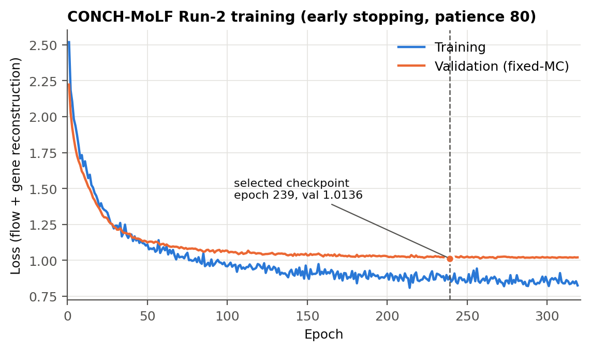
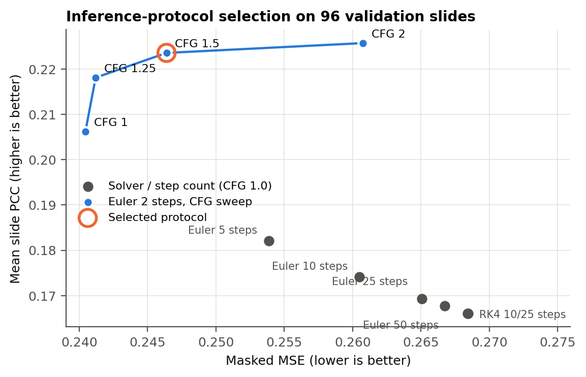

# Results: CONCH-MoLF (Run 2)

Frozen outputs of the final model, finalised on 2026-09-07: training history,
validation and test evaluation, post-hoc diagnostics, and the natural-routing
interpretation of all 23 test slides. Model checkpoints are not included; their
SHA-256 hashes are listed below so a copy can be verified.

## Contents

| Path | Contents |
|---|---|
| `training/training_run.txt.gz` | full training log (a 5-epoch pilot, then resumed to epoch 319) |
| `evaluation/runs/` | raw output of every validation and test inference run (`summary.json`, per-slide and per-gene metrics) |
| `evaluation/*.txt`, `evaluation/*.csv` | protocol decisions, the final test result, per-slide test metrics, GeneVAE-v2 reconstruction and target-distribution diagnostics |
| `interpretability/<sample_id>/` | per-slide routing, top-256 affinity patches and concept scores, with a `SHA256SUMS.txt` and `manifest.json` |
| `interpretability/aggregate/` | cross-slide routing, semantic and stability tables, and their figures |
| `summary/` | tables derived from the above by `scripts/summarize_results.py` |

The raw per-patch router dumps (`router_contexts.csv`) listed in the per-slide
manifests are not included because of their size.

## Data

504 HEST-1k slides: 385 training, 96 validation, 23 test
([`../data/splits/`](../data/splits/)). Slides do not overlap between splits,
but a few test slides share a patient or study with training slides, so the
test set measures performance on unseen slides rather than unseen patients.

The image inputs are frozen CONCH patch embeddings (512-d, float32,
L2-normalised). The final audit re-opened all 504 slides and checked the
1,076,882 embeddings for dimension, dtype, finiteness and norm, and checked
that barcodes, patch order and coordinates match the expression data.

## Model

| Component | Details | Checkpoint SHA-256 |
|---|---|---|
| GeneVAE-v2 | 1,386 genes, 128-d latent, best epoch 929; no positional encoding over the patch sequence, patch-context Transformer; frozen during MoLF training | `cf58dafe7e37987fb24a046676a1a04a24a2c992fb74eeef4203840d48f00cc6` |
| CONCH-MoLF | 512-d CONCH input, 6 experts, top-2 router, patch-context attention without sequence positional encoding; best epoch 239 | `dbe23d4e2f670749ee746272337a21d3d14e49fc6dab34dd43bea05fb727965d` |

Neither model uses x/y coordinates as input. The GeneVAE weights stored inside
the MoLF checkpoint are identical to the standalone GeneVAE-v2 checkpoint
(all 28 tensors, maximum absolute difference 0). Training stopped at epoch 319
after 80 epochs without improvement; selecting epoch 239 was reproduced from
the full training history.

## Inference protocol

Chosen on validation data only: Euler solver, 2 steps (step size 0.5),
classifier-free guidance 1.5, evaluated with 5 noise seeds. CFG 1.0 gave the
lowest error and CFG 2.0 the highest correlation; 1.5 was taken as the
trade-off point (`evaluation/FINAL_INFERENCE_PROTOCOL.txt`). Protocol file
SHA-256: `e3939b92785ed85c1c15d54fa37204a16a030a301badca1b4cc8189862118dfc`.

## Test results

Mean ± sample SD over the 5 noise seeds on the 23 test slides. The test set was
evaluated once, after the protocol was fixed, and nothing was tuned on it.
Errors are computed over measured genes only. Each PCC is a per-gene
correlation across the spots of one slide; the slide metrics average these over
genes first, the gene metric averages over slides first.

| Metric | Value |
|---|---|
| Masked MSE | 0.369907283 ± 0.000197512 |
| Masked RMSE | 0.608200018 ± 0.000162363 |
| Masked MAE | 0.367716582 ± 0.000088076 |
| Mean slide PCC | 0.246431064 ± 0.000409378 |
| Median slide PCC | 0.184601000 ± 0.001584148 |
| Mean gene PCC | 0.166238990 ± 0.000525587 |

`evaluation/RUN2_POSTHOC_DIAGNOSTIC_SUMMARY.txt` breaks these down by platform
(Visium vs. Xenium) and compares them with GeneVAE-v2 reconstruction alone.

## Interpretability

All 23 test slides (92,507 patches) were run through the frozen model with the
frozen protocol: 5 seeds, both Euler states, 6 experts. For every slide and
expert the outputs contain the natural route weights, the 256 patches with the
highest router affinity, and scores against all 2,450 visual *Homo sapiens*
CONCH concepts. Router quantities are taken from the conditional (image)
branch at the latent states visited during guided sampling.

Two quantities are kept apart throughout: *affinity* (router probability, used
to pick an expert's top patches) and *natural utilisation* (the top-2 route
weight the model actually applies). They can differ a lot: Expert 3's 256
highest-affinity patches are routed to it only 8% of the time, against 83% for
Expert 4 (`interpretability/aggregate/routing_by_slide.csv`).

Slide-averaged route weights are 0.240, 0.025, 0.128, 0.007, 0.338 and 0.262
for Experts 0 to 5. Routing differs between Visium and Xenium slides (Expert 2
is used far more on Xenium), but platform is confounded with tissue and study
here. Concept profiles are only weakly stable across slides, somewhat more so
within one platform, so an expert should not be given a single pathology label
from one slide. The concept alignment is correlational.

`summary/expert_lexicon_filtered.csv` repeats the lexicon without 188 concepts
that cannot be H&E findings (other species, cytology only, marker-defined
subsets); see `../docs/concept_bank.md`. It is recomputed from the per-slide
scores here and leaves the frozen outputs unchanged.

## Known issues in the frozen code

- `normalize_adata` applies `log1p` only; its docstring also mentions
  total-count normalisation, which the code does not do.
- `HESTGraphDataset` has an outdated tuple interface and `save_hdf5` has a typo
  in its append branch. Neither is used by training, evaluation or
  interpretation.

The final audit (`../docs/audit/FINAL_RUN2_PREZIP_FORENSIC_AUDIT.txt`) found no
defect affecting the executed training, inference, evaluation or
interpretation, and passed with the caveats above.
